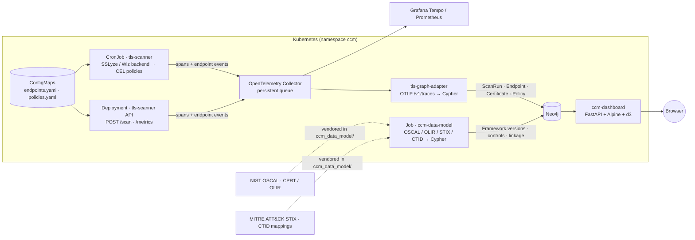
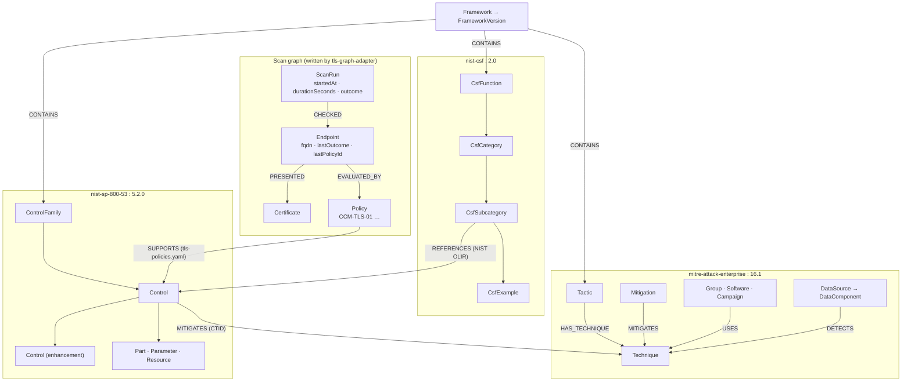

# Continuous Controls Evaluation and Monitoring (CCM)

CCM continuously checks TLS endpoints from inside Kubernetes, records every result as a graph in Neo4j, and shows what that evidence means against NIST CSF 2.0, NIST SP 800-53 Rev 5 and MITRE ATT&CK — live, on a dashboard.

The TLS check is deliberately narrow (one FQDN list, port 443, CEL policies). Everything after it is generic: the scan path emits OpenTelemetry, an adapter turns telemetry into graph facts, the compliance frameworks are ingested as their own versioned subgraphs, and mapping files connect scanner policies to controls. Adding a scanner or a framework means adding a backend or a catalog, not a new pipeline.

## Architecture



The scanner is a `CronJob`, not an operator: deployment and failure semantics stay simple while the endpoint list remains centrally configured. Results never go to the graph directly — they travel as OpenTelemetry spans through the Collector, which also feeds Tempo/Prometheus, so the graph adapter is just another exporter target with retry and a persistent queue in front of it.

## Repository layout

| Path | What it is |
|---|---|
| `tls_scanner/` | The TLS checker: SSLyze/Wiz backends, CEL policy engine, Prometheus metrics, OpenTelemetry emission, CLI (`python -m tls_scanner.main`) and HTTP API (`tls_scanner.api`). |
| `tls_graph_adapter/` | OTLP receiver that writes scan facts to Neo4j (`/v1/traces`). |
| `ccm_data_model/` | Compliance frameworks and mappings — NIST SP 800-53 r5.2.0 (official OSCAL), NIST CSF 2.0 (OSCAL, generated), OLIR CSF→800-53 linkage, MITRE ATT&CK v16.1 (STIX) and CTID 800-53→ATT&CK mappings, plus the CCM policy→control mapping — and the Neo4j ingestion (`python -m ccm_data_model.ingest`). Provenance in `ccm_data_model/SOURCES.md`. |
| `ccm_dashboard/` | Read-only dashboard over Neo4j: endpoint state, scan history, CSF / SP 800-53 coverage sunbursts. |
| `tests/` | Unit tests for all four packages (`python -m pytest`). |
| `Dockerfile*` | One image per component: `tls-scanner`, `tls-graph-adapter`, `ccm-data-model`, `ccm-dashboard`. |

Kubernetes manifests (ConfigMaps, CronJob, Deployments, Collector, Neo4j, Vault/External Secrets, Gateway route) are managed outside this repository.

## Quick start

```bash
python -m pytest -q                                   # unit tests, no network or database needed

# TLS scan from the CLI (JSON lines per endpoint; exit 1 on aggregate fail)
python -m tls_scanner.main --endpoints-config endpoints.yaml --policies-config policies.yaml

# load the compliance frameworks and policy mappings into Neo4j (idempotent; --dry-run validates only)
NEO4J_URI=bolt://neo4j:7687 NEO4J_PASSWORD=… python -m ccm_data_model.ingest

# dashboard against that database
NEO4J_URI=bolt://neo4j:7687 NEO4J_PASSWORD=… python -m uvicorn ccm_dashboard.main:app --port 8080

# images (arm64 shown; the cluster runs on Raspberry Pi nodes)
docker buildx build --platform linux/arm64 -f Dockerfile.ccm-dashboard -t mthorley/ccm-dashboard:latest --push .
```

All Neo4j-backed components read `NEO4J_URI`, `NEO4J_USER` (default `neo4j`), `NEO4J_PASSWORD` and `NEO4J_DATABASE` (default `neo4j`).

## TLS scanner

### Configuration

The configuration is split into two ConfigMaps. The endpoint ConfigMap contains the FQDN list and timeout:

```yaml
endpoints:
  - example.com
  - www.python.org
timeout_seconds: 10
```

The policy ConfigMap contains only the ordered CEL policies:

```yaml
policies:
  - id: CCM-TLS-01
    name: tls-must-be-valid
    expression: "!result.reachable || !result.certificate_valid || !result.hostname_verified"
    outcome: fail
  - id: CCM-TLS-02
    name: certificate-expiry-warning
    expression: "result.expires_in_seconds >= 0 && result.expires_in_seconds < 604800"
    outcome: warn
  - id: CCM-TLS-04
    name: cipher-suite-compliance
    expression: "approved TLS 1.2 or TLS 1.3 cipher suite"
    outcome: fail
```

Endpoints are normalized to lowercase and trailing dots are removed. Port `443` is fixed in the first version. The optional `ca_file` setting supports a mounted private CA bundle.

### TLS probe contract

The Python probe uses SSLyze `6.3.1` on Python `3.12`, requesting certificate-info and TLS 1.2/TLS 1.3 cipher-suite scans with a bounded network timeout. It records these stable fields for CEL:

- `reachable`, `certificate_valid`, and `hostname_verified`
- `tls_version` and negotiated `cipher`
- certificate `subject`, `issuer`, DNS SANs, `expires_at`, and `expires_in_seconds`
- normalized `error_category` and diagnostic `error`

The probe sets a minimum TLS version of TLS 1.2. Acceptance of the negotiated version and cipher is a CEL policy decision. Network failures, certificate failures, and hostname mismatches become result facts rather than exceptions that bypass policy evaluation.

`CCM-TLS-04` permits the following cipher suites: `ECDHE-RSA-AES128-GCM-SHA256`, `ECDHE-RSA-AES256-GCM-SHA384`, `ECDHE-ECDSA-AES128-GCM-SHA256`, and `ECDHE-ECDSA-AES256-GCM-SHA384` for TLS 1.2; and `TLS_AES_128_GCM_SHA256`, `TLS_AES_256_GCM_SHA384`, and `TLS_CHACHA20_POLY1305_SHA256` for TLS 1.3. Any other negotiated cipher fails the policy.

### CEL policy evaluation

Policies are compiled and type-checked before the first network check. They are evaluated in order against a single activation:

```text
result: map<string, scalar or list>
```

Each policy has a stable `id` for logs, metrics, and future status reporting. Expressions are side-effect-free and cannot perform DNS, network, filesystem, or Kubernetes operations. A matching policy returns its configured `pass`, `warn`, or `fail` outcome. If no policy matches, the endpoint passes. An invalid expression or unsupported outcome fails startup rather than silently accepting an unsafe policy.

The aggregate result is `fail` if any endpoint fails, otherwise `warn` if any endpoint warns, otherwise `pass`. The process exits nonzero only for an aggregate `fail`, allowing warnings to remain visible without causing a failed CronJob.

### Immediate HTTP scan

The API deployment exposes `GET /healthz` and `POST /scan`. `POST /scan` executes the same configured endpoint list and CEL policies immediately and returns the aggregate outcome plus per-endpoint results. It does not accept arbitrary hosts in the request, preventing the service from becoming an unrestricted outbound scanning proxy. The API is synchronous, so callers should use a client timeout at least as long as the configured scan timeout multiplied by the endpoint count.

## OpenTelemetry and the scan graph

The shared scan path emits OpenTelemetry spans and endpoint result events. Each scan has a stable `tls.scan.id`; events include the scanner backend, endpoint, policy ID, outcome, TLS version, cipher, certificate status, expiry, normalized error category, and the per-endpoint check time as `tls.check.duration_seconds`. The `tls.scan` span carries the aggregate outcome and the end-to-end execution time as `tls.scan.duration_seconds`; `POST /scan` returns the same value as `duration_seconds`. Configure `OTEL_EXPORTER_OTLP_ENDPOINT` to send these spans to an OpenTelemetry Collector.

The scanner supports interchangeable backends through `TLS_SCANNER_BACKEND`: `sslyze` is the default, and `wiz` sends `{"endpoint": "..."}` to `WIZ_SCANNER_URL/scan`, optionally using `WIZ_SCANNER_TOKEN`. Both backends return the same `TLSResult` contract, so CEL, Prometheus, OTEL, and downstream graph processing are scanner-independent. The CLI calls `force_flush()` and `shutdown()` before exit so CronJob spans are exported before the process terminates.

Route OTEL spans from the Collector to Grafana Tempo/Prometheus and to `tls-graph-adapter:4318`. The Collector uses retry-on-failure and a file-backed sending queue on a persistent volume. The adapter consumes OTLP protobuf at `/v1/traces` and creates `ScanRun`, `Endpoint`, `Certificate`, and `Policy` nodes in Neo4j using idempotent `MERGE` operations. It connects them with `CHECKED`, `PRESENTED`, and `EVALUATED_BY` relationships. Execution time is stored on `ScanRun` (`durationSeconds`, `startedAt`, `finishedAt`, `endpointCount`, `outcome`) and per check on the `CHECKED` relationship (`durationSeconds`, `scanStartedAt`) and `Endpoint` (`lastCheckDurationSeconds`, `lastCheckedAt`). Timestamps come from the scan span's start time, not the adapter's write time, so they reflect when the scan ran even if the Collector queue delays delivery. Each `Endpoint` also records `lastScanId` and `lastPolicyId` (the policy that produced its current outcome).

The development cluster runs a single-node Neo4j `5.26-community` StatefulSet with a `10Gi` PVC and a `neo4j:7687` Bolt Service, with credentials delivered by External Secrets Operator from a development Vault (`secret/data/ccm/neo4j` → `neo4j-credentials`). Production deployments should use managed Vault/Neo4j services or their operators, Kubernetes authentication instead of a root token, backups, TLS, and a storage class with snapshot support.

## Compliance data model

Everything in Neo4j hangs off a framework version, and the scanner's facts join to the frameworks through `Policy`:



`ccm_data_model/` holds the compliance frameworks the scan results are assessed against, plus the ingestion that loads them into the same Neo4j database as the scan graph. `ccm_data_model/SOURCES.md` records where each file comes from and how to refresh it.

- `nist/nist-sp-800-53-rev5.oscal.yaml` is NIST's **official OSCAL catalog of SP 800-53 Rev 5.2.0** (oscal-content release v1.5.0), stored verbatim: 20 families, 324 controls, 872 enhancements, 182 marked `status: withdrawn`. The loader flattens each control's statement (resolving `{{ insert: param }}` placeholders into `[Assignment: …]` / `[Selection: …]` text), keeps the guidance, and rewrites `related` / `incorporated-into` / `moved-to` links to canonical control labels (`SC-8(1)`, not `sc-8.1`).
- `nist/nist-csf-2.0.oscal.yaml` is the CSF 2.0 core as an OSCAL 1.1.2 catalog, generated from NIST's CPRT export by `python -m ccm_data_model.build_csf_catalog` (NIST publishes no OSCAL form of the CSF). Functions and categories are `groups`, subcategories are `controls` with the official statement, implementation examples as `example` parts, and SP 800-53 family references as props.
- `mappings/nist-csf-2.0-to-sp800-53-rev5.yaml` is the **CSF 2.0 ↔ SP 800-53 linkage**: NIST's OLIR informative reference `Cybersecurity-Framework-v2.0-to-SP-800-53-Rev-5-2-0`, 746 pairs generated by `python -m ccm_data_model.build_csf_linkage`. Every current subcategory has references; two categories (`RC.RP`, `RS.MA`) and three family-level references are represented too. The OSCAL 800-53 catalog itself does not carry this linkage, which is why it is a separate file.
- `mitre/enterprise-attack-16.1.json.gz` is the official **MITRE ATT&CK Enterprise v16.1 STIX 2.1 bundle**, stored verbatim (gzipped). The loader takes every object type — 14 tactics (in matrix order), 799 techniques and sub-techniques (with description, detection guidance, platforms, data sources and every other `x_mitre_*` field), 285 mitigations, 175 groups, 714 software, 34 campaigns, 38 data sources with 109 data components — and 20k relationships (`USES`, `MITIGATES`, `DETECTS`, `ATTRIBUTED_TO`, `REVOKED_BY`). Revoked and deprecated objects are kept and flagged; the two ATT&CK ids carried by twin STIX objects (G0058, S0154) collapse to the live one.
- `mitre/nist_800_53-rev5_attack-16.1-enterprise.json` is the MITRE Center for Threat-Informed Defense **mappings-explorer** file for SP 800-53 Rev 5 → ATT&CK v16.1 Enterprise, stored verbatim: 5,263 distinct `mitigates` relationships from 109 controls to techniques in the bundle. The loader refuses a file built for another 800-53 revision or ATT&CK version, and reports CTID ids absent from the bundle (one, `T1521.003`, a Mobile technique).
- `mappings/tls-policies.yaml` maps the CEL policy IDs (`CCM-TLS-01`…`04`) to SP 800-53 controls (`SC-8`, `SC-8(1)`, `SC-13`, `SC-17`, `SC-23`, `IA-5`, `CM-6`) with a rationale per pair. Policies are mapped to 800-53 only; CSF coverage is derived through the linkage. Ingestion rejects control IDs that are not in the catalog; any of `SC-8`, `SC-08`, `sc-8.1`, `SC-8(1)` spellings resolve.
- `python -m ccm_data_model.ingest` writes everything into Neo4j using `NEO4J_URI`, `NEO4J_USER`, `NEO4J_PASSWORD`, and `NEO4J_DATABASE`. `--dry-run` validates the files and prints counts without connecting; `--purge-versions` deletes the three framework versions' subgraphs first (nothing else) for a clean reload. `Dockerfile.ccm-data-model` packages it for a one-shot Kubernetes `Job`; re-run it whenever a catalog or mapping changes.

Graph model — every framework **version** is an isolated subgraph under its own root:

```text
(:Framework {id: "nist-sp-800-53"})-[:HAS_VERSION]->(:FrameworkVersion {id: "nist-sp-800-53:5.2.0", version: "5.2.0", uuid, lastModified})
    -[:CONTAINS]->(:ControlFamily {id: "SC"})
    -[:CONTAINS]->(:Control {id: "SC-8", statement, guidance, status, implementationLevel})
    -[:CONTAINS]->(:Control {id: "SC-8(1)", enhancement: true, parentId: "SC-8"})
(:Control)-[:RELATED|REQUIRES|INCORPORATED_INTO|MOVED_TO]->(:Control)
(:Control)-[:HAS_PARAMETER]->(:Parameter {id: "sc-08.01_odp", text, choices, guidelines})   # organization-defined parameters
(:Control)-[:HAS_PART]->(:Part {name: "statement"})-[:HAS_PART]->(:Part {name: "item", label: "a."})
(:Control)-[:HAS_PART]->(:Part {name: "guidance" | "assessment-objective" | "assessment-method"})  # SP 800-53A
(:Part {name: "assessment-objective"})-[:ASSESSES]->(:Part {name: "item"})
(:Part {name: "assessment-method", method: "EXAMINE"})-[:HAS_PART]->(:Part {name: "assessment-objects"})
(:Control)-[:CITES]->(:Resource {title: "FIPS 140-3", doi})                                 # back-matter, also CONTAINed by the version

(:Framework {id: "nist-csf"})-[:HAS_VERSION]->(:FrameworkVersion {id: "nist-csf:2.0"})
    -[:CONTAINS]->(:CsfFunction)-[:CONTAINS]->(:CsfCategory)-[:CONTAINS]->(:CsfSubcategory)-[:HAS_EXAMPLE]->(:CsfExample)

(:Framework {id: "mitre-attack-enterprise"})-[:HAS_VERSION]->(:FrameworkVersion {id: "mitre-attack-enterprise:16.1"})
    -[:CONTAINS]->(:Tactic {id: "TA0006", order})-[:HAS_TECHNIQUE]->(:Technique)
    -[:CONTAINS]->(:Technique {id: "T1557", name, description, detection, platforms})-[:CONTAINS]->(:Technique {id: "T1557.002", parentId})
    -[:CONTAINS]->(:Mitigation {id: "M1041"})-[:MITIGATES]->(:Technique)
    -[:CONTAINS]->(:Group {id: "G0016"} | :Software {id: "S0154", softwareKind} | :Campaign {id: "C0022"})-[:USES]->(:Technique | :Software)
    -[:CONTAINS]->(:Campaign)-[:ATTRIBUTED_TO]->(:Group)
    -[:CONTAINS]->(:DataSource {id: "DS0029"})-[:CONTAINS]->(:DataComponent {id: "DS0029:Network Traffic Content"})-[:DETECTS]->(:Technique)

(:CsfSubcategory|:CsfCategory)-[:REFERENCES {source}]->(:Control|:ControlFamily)   # OLIR informative references
(:Control)-[:MITIGATES {mappingType, source}]->(:Technique)                        # CTID mappings-explorer (source label distinguishes it from Mitigation-[:MITIGATES])
(:Policy {id: "CCM-TLS-03"})-[:SUPPORTS {rationale, source}]->(:Control)          # CCM mapping
```

Every catalog node carries `id` (the human identifier, `SC-8`), `framework`, `version`, and `key = "<framework>:<version>/<id>"`; uniqueness constraints are on `key`. So when NIST publishes Rev 5.3 (or CSF 2.1), ingesting it creates a second `FrameworkVersion` with its own complete subgraph — no node is shared with, merged into, or modified in the previous version, and both can be queried side by side (`MATCH (c:Control {id: "SC-8"}) RETURN c.version`). The whole OSCAL catalog is loaded: 1,196 controls, 1,600 parameters, 12,729 parts (statement items, guidance, 800-53A objectives, methods and assessment objects), 201 cited resources, and all `related` / `required` / `incorporated-into` / `moved-to` links. Only `Policy` nodes are keyed by `id` alone, because they are shared with the TLS graph adapter.

Mapping files are **pinned** to the version they were validated against (`framework` + `version` in `tls-policies.yaml`; `source_version` / `target_version` in the linkage file). Ingesting against a different catalog version fails before writing, so a new NIST revision never silently inherits the old control mapping: bump the version in the file after reviewing it, re-ingest, and the `SUPPORTS` / `REFERENCES` edges into the previous version are retired by the stale-edge prune while the previous version's catalog stays intact.

`Policy` nodes are the same nodes the graph adapter creates from scan events, so one query joins live evidence to both frameworks. OLIR references point at base controls, so walk up from an enhancement to its parent when deriving CSF coverage:

```cypher
MATCH (e:Endpoint)-[ev:EVALUATED_BY]->(p:Policy)-[:SUPPORTS]->(c:Control {version: "5.2.0"})
MATCH (c)<-[:CONTAINS*0..1]-(base:Control)<-[:REFERENCES]-(s:CsfSubcategory)<-[:CONTAINS]-(cat:CsfCategory)
RETURN cat.id, s.id, base.id, c.id, p.id, e.fqdn, ev.outcome
```

The same join extends to threat coverage — which ATT&CK techniques the TLS checks help mitigate:

```cypher
MATCH (p:Policy)-[:SUPPORTS]->(c:Control)-[:MITIGATES]->(t:Technique {version: "16.1"})
RETURN p.id, count(DISTINCT t) AS techniques, collect(DISTINCT t.id)[..10] AS sample
```

…and, through the STIX bundle, which adversaries those techniques are used by, what ATT&CK says detects them, and how NIST controls compare with ATT&CK's own mitigations:

```cypher
MATCH (p:Policy)-[:SUPPORTS]->(:Control)-[:MITIGATES]->(t:Technique)<-[:USES]-(g:Group)
RETURN p.id, count(DISTINCT t) AS techniques, count(DISTINCT g) AS groups
MATCH (dc:DataComponent)-[:DETECTS]->(t:Technique {id: "T1557"}) RETURN collect(dc.id)
MATCH (m:Mitigation)-[:MITIGATES]->(t:Technique {id: "T1557"})<-[:MITIGATES]-(c:Control) RETURN collect(DISTINCT m.id), collect(DISTINCT c.id)
```

Ingestion is idempotent: every node and relationship is `MERGE`d on its `key`, and `REFERENCES` / `MITIGATES` / `SUPPORTS` edges whose `source` is a mapping file but which are no longer listed in it are deleted, so removing a line removes the edge on the next run. Catalog properties are overwritten in place within a version, which is what you want for corrections.

## Dashboard

The dashboard (`ccm_dashboard/`, served at `/`) is a FastAPI service with an Alpine.js page; it only reads Neo4j. Every query it runs is in `ccm_dashboard/main.py`.

The dashboard's results table shows **one row per endpoint** — its current outcome, TLS version, cipher, latest-expiring certificate, last check time and check duration, attributed to the scan run that produced it (`GET /api/results`). Run history is separate: `GET /api/scans` lists runs newest first (start, scanner, aggregate outcome, endpoints checked, duration) and feeds the "Last scan" card and a collapsible history table; runs recorded before timestamps were stored sort last.

The dashboard's **NIST CSF coverage** section is a csf.tools-style sunburst of the CSF 2.0 core — functions (inner ring), categories, subcategories (outer ring, every subcategory equal-weighted) — with a thin evidence ring outside it. `GET /api/csf` builds it from the graph: for each subcategory, its OLIR-referenced SP 800-53 controls, the CCM policies that `SUPPORTS` those controls (enhancements roll up to their base control), and a status from current endpoint state — `fail`/`warn` if any endpoint's `lastPolicyId` is one of those policies with that outcome, `pass` if endpoints were scanned and none is, `unknown` with no scan data, `unmapped` when no TLS policy reaches the subcategory. Hovering a segment shows the statement, references, policies and per-endpoint outcomes; clicking pins it; a table view lists every subcategory for keyboard and screen-reader use. A **Zoomable** toggle swaps the static CSF wheel for the same d3 zoomable renderer (three rings; click a function or category to zoom; `#csf/PR` or `#csf/PR.DS` deep-link straight there). A segmented toggle (also deep-linkable as `#csf` / `#sp800-53`) swaps in the **SP 800-53 wheel**, fed by `GET /api/sp800-53`. It is a d3 **zoomable sunburst** (`ccm_dashboard/sunburst-zoom.js`, d3 v7 from the same CDN as Alpine): at the top level families are the inner ring and the 300 non-withdrawn base controls the outer ring (equal-weighted); clicking a family makes it the centre and reveals its controls with their enhancements as the outer ring; clicking a control shows its enhancements; clicking the centre (or *← all families*) goes back up, with d3's arc-tween transition. Deep links `#sp800-53/SC` and `#sp800-53/SC-8` land directly on a family or control without animating. A control's status rolls up its enhancements (worst of its own and theirs), and the evidence ring always partitions the circle exactly once: it follows the outermost visible ring plus any leaf on the inner ring, so a control without enhancements shows its own status when zoomed into its family. Because 20 families exceed a readable categorical palette, that wheel uses emphasis colouring: neutral alternating fills for structure, one accent for controls with TLS policy evidence, and direct labels only on those controls. Function hues are a validated categorical set (adjacent ring pairs, including the RC→GV wrap, pass colour-vision-deficiency and normal-vision separation checks on the dashboard surface); status is never colour-alone — every status carries an icon and label. Keep raw certificate contents, tokens, and exception text out of span attributes. The persistent queue still depends on the Kubernetes volume and downstream systems eventually recovering; it is not an infinite or transactional guarantee.

Framework tree responses are cached in-process for ten minutes (`?refresh=true` bypasses; the cache is primed at startup) and gzipped; static assets carry a content hash in their URL so a new page never pairs with a stale stylesheet.

## Tests

`python -m pytest` runs the whole suite (no network, database or Docker required). It covers CEL compilation and policy ordering, scanner backends, telemetry attributes and run timing, the OTLP adapter and its run/timestamp extraction, the data-model loaders (catalog counts and structure, id resolution, linkage and mapping validation incl. version pinning, ATT&CK STIX and CTID parsing) and graph statement shaping, and the dashboard's status roll-ups. Add local TLS fixtures for valid, expired, hostname-mismatch, untrusted, protocol-policy, refusal, and timeout cases before production rollout.

## Future operator

If Kubernetes-native status or watch-driven reconciliation becomes necessary, introduce a `TLSCheck` CRD with `spec.endpoints`, `spec.policies`, and `status.conditions` plus per-endpoint results. A Python operator can reuse the probe result schema and CEL semantics. Kubernetes CEL validation can validate CRD fields, but runtime CEL evaluation is still required for live TLS results.
